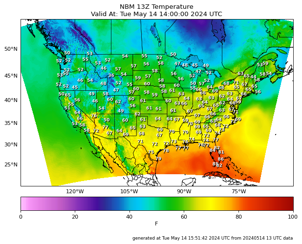
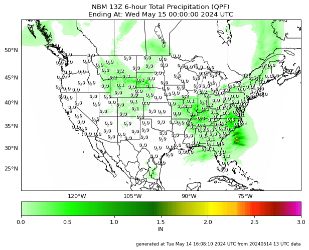

  

    
  

  

    NOAA MDL 
    
     
    <dl>
  
	As a software engineer at Guidehouse, I work with a team in the National Weather Service's (NWS) Meteorological Development Laboratory (MDL) to develop next-generation statistical modeling software to assist in forecasting guidance. As part of the Statistical Modeling Division (SMD), our goal is to not only improve forecasting and post-processing methods scientifically but to empower users by building software tools that are accessible and flexible by leveraging open-source packages. 

</dl>

    
  

<h1>National Blend of Models</h1>

  

<a href="https://blend.mdl.nws.noaa.gov/nbm-images">National Blend of Models Quick-look, submitted</a>

Our primary focus is the National Blend of Models (NBM), a suite of forecast products based on a blend of both NWS and non-NWS numerical weather models, robustly calibrated to provide accurate and consistent forecasting guidance. A critical aspect of the NBM is the post-processing pipeline, in which the blended and calibrated numerical weather models are processed and statistically validated to create useful forecasting guidance products like precipitation accumulations, daily temperatures, and severe weather predictors on a consistent nationwide grid, covering the continental US, Alaska, Hawaii, and Puerto Rico. 

As part of the SMD team, I am involved with the development, testing, and implementation of statistical pipelines to improve the reliability of precipitation forecasts. These involve the treatment of ensemble forecasts and developing ways to improve the statistical calibrations to decrease forecast biases and errors. 

