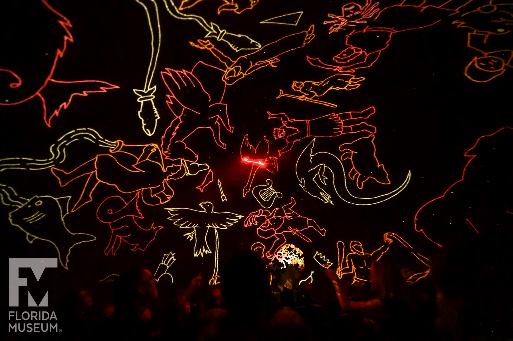

	

    <section class="hero  is-small  ">
        

            

                

                    
                        

                            
                            

                            
                                <i class="fas fa-envelope fa-4x"></i>
                            
                            

                            
                            
Email

                            

                            
                            

                            
                            <a href="mailto:s.lower@ufl.edu" class="button is-primary">
                                s.lower@ufl.edu
                            </a>
                            
                        

                    
                        

                            
                            

                            
                                <i class="fab fa-github fa-4x"></i>
                            
                            

                            
                            
Github

                            

                            
                            

                            
                            <a href="https://github.com/smlower" class="button is-primary">
                                SL @ Github
                            </a>
                            
                        

                    
                        

                            
                            

                            
                                <i class="fas fa-book fa-4x"></i>
                            
                            

                            
                            
Google Scholar

                            

                            
                            

                            
                            <a href="https://scholar.google.com/citations?user=Rhxu2vsAAAAJ&hl=en" class="button is-primary">
                                SL @ Google Scholar
                            </a>
                            
                        

                    
                        

                            
                            

                            
                                <i class="fab fa-twitter fa-4x"></i>
                            
                            

                            
                            
Twitter

                            

                            
                            

                            
                            <a href="https://twitter.com/es_em_ell" class="button is-primary">
                                SL @ Twitter
                            </a>
                            
                        

                    
                

            

        

    </section>

    <section class="section">
        

            

                
                

