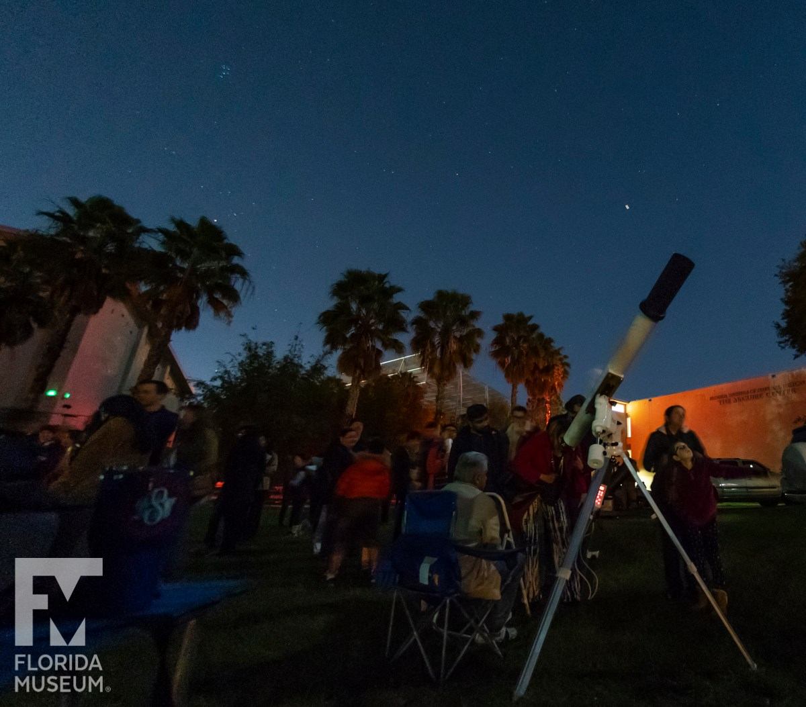
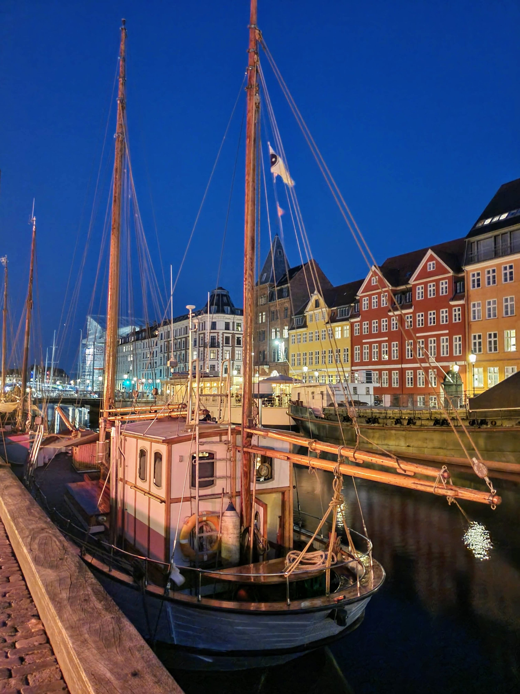
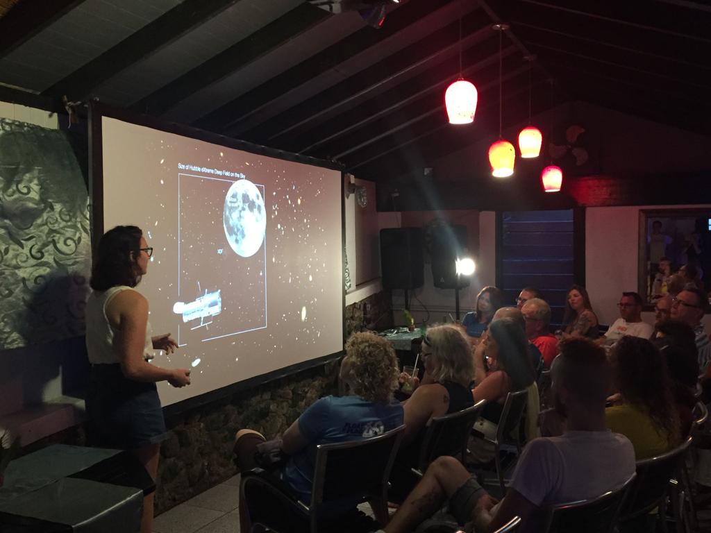
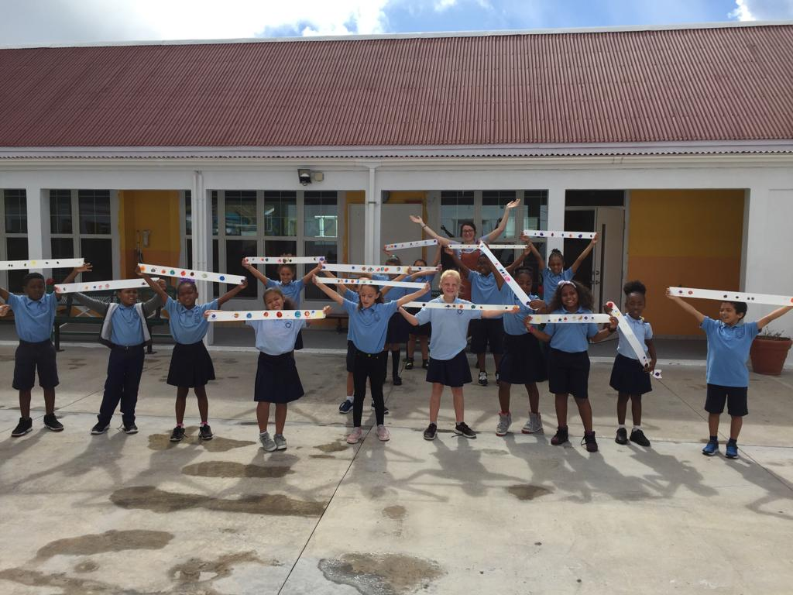
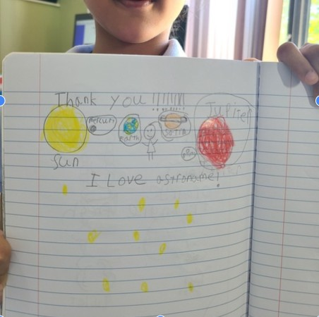
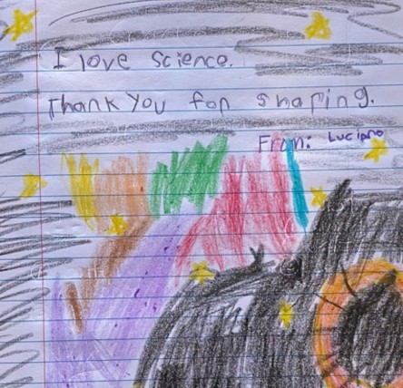
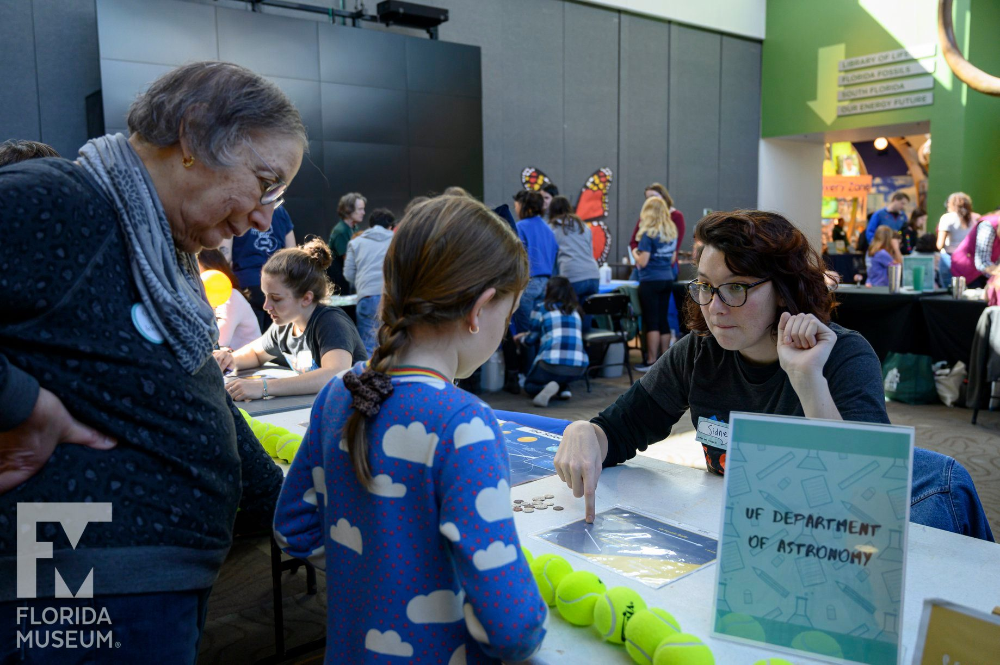

  

    
  

  

    Teaching 
    
     
    <dl>
  <dt>Spring 2020:  AST 1002 <b>Discovering the Universe</b></dt>
  <dd>+ Assisted student discussions and projects covering introductory astronomy topics. </dd>

<dt>Fall 2019: AST4930/7939 <b>Computational Astrophysics</b></dt>
  <dd>+ Assist students with Python projects, including submitting and running jobs on a supercomputer cluster. </dd>

<dt> Fall 2018 & Spring 2019: AST1022L <b>Astronomy Laboratory</b></dt>
     <dd>+ Lectures covering basics of astronomy with hands on labs including telescopes, spectroscopy, CCD cameras, and cosmology.</dd>
     <dd>+ Night labs including observations of the Moon, planets, and deep sky (nebulae, globular clusters, and Andromeda). </dd>
</dl>

    
  

<h1>Mentorship</h1>

I've been incredibly lucky to have been a mentor as part of three programs, enabling more and more students to learn the joys of science and get exciting hands-on expereince with cutting edge research. Mentorship has allowed me to connect with incredible students and fantastic scientist in several collaborations; without previous experience as a mentee myself, I wouldn't have been able to pursue the path I'm currently on in my career as a scientist. Below you can find out more about these mentorship opportunties!

  

  

    <figure class="image">
      
    </figure>
  

  

  

        
DAWN IRES

      

 
The <a href="https://www.dawnires.com/what-we-do">DAWN-IRES scholars program</a> invites advanced undergraduates to be mentored by researchers at the Cosmic Dawn Center of Excellence in Copenhagen, Denmark and by graduate students from around the globe. As a graduate research <a href="https://www.dawnires.com/scholarsblog/meet-the-dawn-ires-scholars-sidney-lower">mentor</a> in the 2021 cohort, I created and co-led professional development seminars and weekly research check-ins with the undergrad researchers.
    

  

  

  

  

    <figure class="image">
      
    </figure>
  

  

  

	
NSF REU

      

 
The summer 2022 REU cohort at UF spent 10 weeks getting hands on research with faculty in the Department of Astronomy. In just 10 weeks, students were introduced to a research problem and worked hard to understand how to tackle cutting edge problems in a diverse array of astronomy fields. I co-mentored one student in a project focused on the star formation lifecycle of galaxies, using cosmological simulations to gain insight into how we can better measure star formation rates as galaxies turn towards quiescence. 
    

  

  

  

  

    <figure class="image">
      
    </figure>
  

  

  

        
Young Scholars Program

      

 
	The inagural six-week summer-research <a href="https://npl.illinois.edu/programs/young-scholars">Young Scholars Program (YSP)</a> at the University of Illinois at Urbana-Champaign was initiated by members of the Nuclear Physics Laboratory (NPL) group to invite advanced students from local high schools into a variety of research groups to get hands-on experience with cutting edge research. The program aimed to make physics research more inclusive by inviting students from underrepresented backgrounds; in partnership with Identities of Students in Engineering (I-RISE), workshops were provided for mentors to understand how best to be inclusive in a research environment. Students' summer research made contributions to a broad range of physics (9 total) and electro-thermal-power engineering (3 total) projects, such as photon quantum mechanics, dark matter detectors, condensation heat transfer, and 3D power converters. I acted as research mentor for one high schooler in Dr. Douglas Beck's nuclear physics lab. We spent the summer calibrating optics and experimental components that would eventually end up in a real experimental setup. 
    

  

  

<h1>Outreach</h1>

Outside of academics and research, I have always left time to participate in community outreach events. Outreach is a great way to share my interest in physics and astronomy with both younger and older students who may be unable to easily explore different topics in science because of the unavailability of resources in school. Cultivating and continuing interest in the sciences with younger students is important for our society, and giving students with less educational advantages an opportunity to explore their interests is important. The fact that many students do not interact with scientists before college, or not at all, is troubling to me and I want to continue to implement programs that expose more students to what science research is like. 
Since joining the University of Florida astronomy department, I've had fantastic opportunities to talk to people of all ages about science at events like the department's annual Starry Night event, the Sea and Learn outreach program, and the Scientist in Every Florida School program. 

  

  

    <figure class="image">
      
      
    </figure>
  

  

    

    I had a fantastic opportunity to travel to the island of Saba and talk about galaxies with island residents young and old as part of the <a href="https://www.seaandlearn.org/">Saba Sea and Learn</a> program. As part of the program, I gave island residents a tour of the beautiful night sky and taught elementary school students about the vast sizes in space.  
     
    

  

  

  

  

    <figure class="image">
      
      
    </figure>
  

  

    

    With the start of the COVID pandemic, outreach opportunities were rare. Beginning in the fall of 2020, several faculty members and graduate students joined with the Florida Musuem of Natural History's <a href="https://www.floridamuseum.ufl.edu/earth-systems/scientist-in-every-florida-school/">Scientist in Every Florida Classroom</a> program. So far, I have virtually visited nearly 10 schools across the state to talk about astronomy to k-12 students. Each visit I am blown away by the immense curiosity and passion these students have for science -- I am very excited to see all students continue down the path of science exploration.
     
    

  

  

  

  

    <figure class="image">
      
      
    </figure>
  

  

    

    Every November, the UF astronomy department holds the Starry Night event in collaboration with the Florida Museum of Natural History and the Sante Fe College Kika Silva Pla Planetarium, where we share our love for astronomy with the community. The event typically brings more than 1000 local residents to take part in astronomy activities, observing, and watching shows in the mobile Starlab planetarium. 
     
    

  

  

