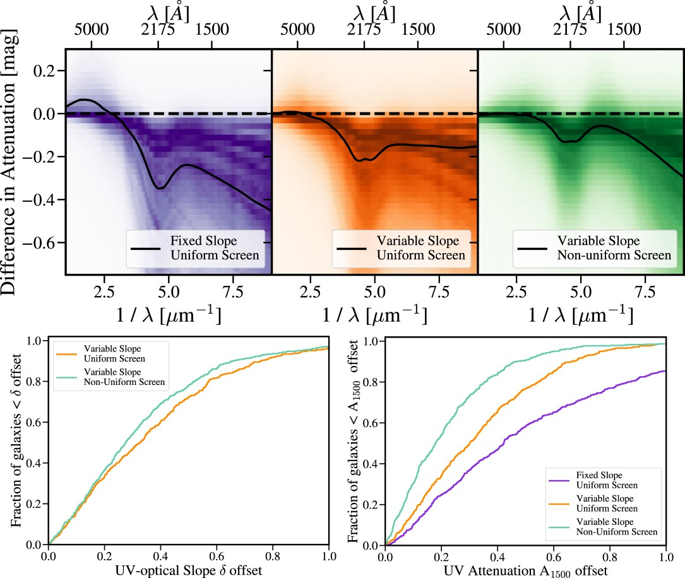
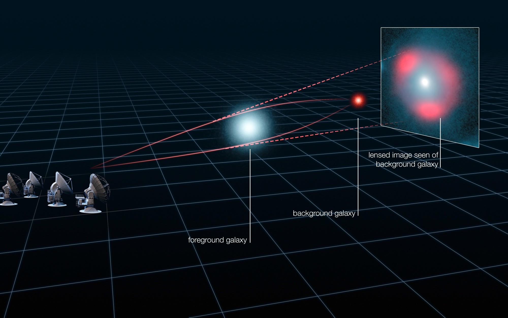

---
#
# Feel free to add content and custom Front Matter to this file.
# To modify the layout, see https://jekyllrb.com/docs/themes/#overriding-theme-defaults

layout: page
title: Exploring Galaxy Formation & Evolution
permalink: research
hero_image: nrao21ao18_Sreevani_FarawayH20_Illustration.jpg
---

<article class="message" style="margin-bottom: 5rem;">
	 
	 

My research interests are broadly described as galaxy formation and evolution. Most of my undergraduate research focused on dusty galaxies in the early Universe, studying their properties, learning a lot about galaxy spectral energy distribution (SED) modeling, and figuring out how to think like a scientist.
  
At University of Florida, I've been working on my PhD with Desika Narayanan. I dabbled a bit more in SED modeling and published two papers using cosmological simulations to 'ground-truth' SED modeling techniques by understanding the assumptions we make when asking a simple question like “How do we measure the stella mass of this galaxy?”
  
As part of my thesis, my current work is again focused on the first dusty galaxies in the Universe and understanding the origin of massive galaxies. Namely, asking questions like how they achieved huge star formation rates, how they formed huge reservoirs of dust, and what is their fate as they evolve over cosmic time.  I spend my time analyzing hydrodynamic simulation outputs, thinking about how to visualize large and multi-dimensional datasets, and finding causal connections between the complex physical systems that drive galaxy formation and evolution. Below you'll find more in depth descriptions of the projects I've lead or co-lead at UIUC and UF.

</article>

<h1>Projects</h1>

<h2>Cosmic Sands: Digging into the Formation of the First Dusty Galaxies</h2>

     <a href="https://ui.adsabs.harvard.edu/abs/2022arXiv221202636L/abstract">Lower et al. 2022, submitted</a>
     

 
By the time the Universe was only 1 billion years old, the dawn of galaxy formation was already well underway. Yet our theoretical understanding of these processes - the formation of massive, enriched systems - remains uncertain. And now with the much anticipated launch of JWST ushering in an exciting era of high redshift astronomy, understanding the formation of the earliest dusty galaxies is now a top priority. My current thesis work focuses on developing models in cosmological simulations to understand the growth of the first massive galaxies - from rare over-densities in the Cosmic dark ages to compact and dust enriched galaxies at Cosmic dawn. 
 
 
Employing state-of-the-art prescriptions for gas hydrodynamics, black hole and star formation, dust production and growth, and post-process radiative transfer, I have generated a suite of massive halos hosting dust rich galaxies with properties similar to observed galaxies targeted by SCUBA, SPT, ALMA, and now JWST. Our models suggest that steady streams of gas accretion from filaments in the dark matter halos drive intense star formation at 100-1000x that of the Milky Way, allowing these galaxies to amass billions of solar masses in stars and the subsequent production of stardust in only a few hundred million years. 
 
 

<h2>Improving Galaxy SED Modeling With Cosmological Simulations</h2>

The primary method for inferring the stellar mass of a galaxy is through spectral energy distribution (SED) modeling. However, the technique rests on assumptions such as the galaxy star formation history (SFH) and dust attenuation law that can severely impact the accuracy of derived physical properties from SED modeling. I'm interested in examining the impact of various model assumptions on inferred galaxy properties, and the projects I'm working on are summarized below:

  

  

    <figure class="image">
      
    </figure>
  

  

    

    <b>Nonparametric SFHs:</b> First, in <a href="https://ui.adsabs.harvard.edu/abs/2020ApJ...904...33L/abstract">Lower et al. 2020</a> I examined the efficacy of non-parametric SFHs, that is, models for the star formation history of a galaxy that do not explicitly assume a shape, and the contribution to the uncertainty on inferred galaxy stellar masses from the SFH alone.
     
    

  

  

  

  

    <figure class="image">
      
    </figure>
  

  

    

    <b>Mirkwood ML-Powered SED Modeling:</b> In <a href="https://ui.adsabs.harvard.edu/abs/2021ApJ...916...43G/abstract">Gilda, Lower, & Narayanan 2021</a>, we developed a machine learning framework, trained on a suite of 3 cosmological hydrodynamical simulations, to infer galaxy physical properties from broadband photometry. Our fiducial model outperforms state-of-the-art Bayesian inference based SED fitting, paving the way for next-generation machine learning based SED modeling.
 
    

  

  

  

  

    <figure class="image">
      
    </figure>
  

  

    

   <b>Accounting for Geometry in Dust Attenuation Models:</b> My <a href="https://ui.adsabs.harvard.edu/abs/2022ApJ...931...14L/abstract">latest published work</a> expands on Lower et al. 2020 by incorporating the impact of diffuse dust and developing a model for dust attenuation that includes a term to describe the star-dust geometry of a galaxy. Namely, we show that allowing deviations from a uniform screen model, in which all stellar light is attenuated by equal optical depth, our ability to infer the true galaxy attenuation curves, and most importantly, dust-corrected star formation rates is greatly improved over traditional methods.
 
    

  

  

<h2>Infrared and Radio Properties of High Redshift Dusty Star Forming Galaxies</h2>

My first experiences with research in undergrad at UIUC focused on galaxies discovered with the South Pole Telescope (SPT). These galaxies comprise a catalog of systematically selected gravitationally lensed dusty galaxies. Gravitational lensing results from massive foreground galaxies or galaxy clusters bending light emitted from background galaxies towards Earth, magnifying the brightness which allows fainter and higher redshift galaxies to be seen. As a consequence, these sources are selected to be at high redshift and are very luminous at  sub-mm wavelengths. Under the supervision of Dr. Joaquin Vieira, my work broadly involved characterizing these sources in terms of their physical properties. I estimated the number density of the SPT source catalog, fit modified blackbody SEDs to their photometry to estimate dust properties, and analyzed radio data from ATCA to determine the far-infrared radio correlation at high redshift. 

  

<h1>Publications</h1>

<h2>First and Second Author</h2>

<ul>
<li><b>How Well Can We Measure Galaxy Dust Attenuation Curves? The Impact of the Assumed Star-Dust Geometry Model in SED Fitting</b>, Sidney Lower, Desika Narayanan, Joel Leja, Benjamin D. Johnson, Charlie Conroy, Romeel Davé; 2022, ApJ, 93, 14</li>

<li><b>Mirkwood: Fast and Accurate SED Modeling Using Machine Learning</b>, Sankalp Gilda, Sidney Lower, Desika Narayanan; 2021, ApJ, 916, 43</li>

<li><b>How Well Can We Measure the Stellar Mass of a Galaxy: The Impact of the Assumed Star Formation History Model in SED Fitting</b>, Sidney Lower, Desika Narayanan, Joel Leja, Benjamin D. Johnson, Charlie Conroy, Romeel Davé; 2020, ApJ, 904, 33</li>
</ul>

<h2>Collaborating</h2>

<ul>
<li><b>Galaxy Growth in a Massive Halo in the First Billion Years of Cosmic History</b>, Marrone, D. P., J. S. Spilker, C. C. Hayward, J. D. Vieira, et al., including S. Lower, 2018, Nature, 553, 51</li>

<li><a href="https://ui.adsabs.harvard.edu/search/filter_aff_facet_hier_fq_aff=OR&filter_aff_facet_hier_fq_aff=aff_facet_hier%3A%220%2FU%20FL%22&filter_aff_facet_hier_fq_aff=aff_facet_hier%3A%220%2FUIUC%22&filter_property_fq_property=AND&filter_property_fq_property=property%3A%22refereed%22&fq=%7B!type%3Daqp%20v%3D%24fq_property%7D&fq=%7B!type%3Daqp%20v%3D%24fq_aff%7D&fq_aff=(aff_facet_hier%3A%220%2FU%20FL%22%20OR%20aff_facet_hier%3A%220%2FUIUC%22)&fq_property=(property%3A%22refereed%22)&q=author%3A%22Lower%2C%20Sidney%22&sort=date%20desc%2C%20bibcode%20desc&p_=0)https://ui.adsabs.harvard.edu/search/filter_aff_facet_hier_fq_aff=OR&filter_aff_facet_hier_fq_aff=aff_facet_hier%3A%220%2FU%20FL%22&filter_aff_facet_hier_fq_aff=aff_facet_hier%3A%220%2FUIUC%22&filter_property_fq_property=AND&filter_property_fq_property=property%3A%22refereed%22&fq=%7B!type%3Daqp%20v%3D%24fq_property%7D&fq=%7B!type%3Daqp%20v%3D%24fq_aff%7D&fq_aff=(aff_facet_hier%3A%220%2FU%20FL%22%20OR%20aff_facet_hier%3A%220%2FUIUC%22)&fq_property=(property%3A%22refereed%22)&q=author%3A%22Lower%2C%20Sidney%22&sort=date%20desc%2C%20bibcode%20desc&p_=0">and more on ADS</a> </li>
</ul>

